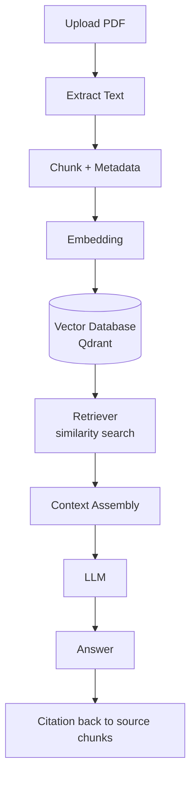

# rag-pipeline

An educational, end-to-end **Retrieval-Augmented Generation (RAG)** pipeline in Python.
It walks a document from **PDF upload → grounded answer with citations**, making every
RAG stage explicit and easy to understand.

The goal is learning: chunking, metadata, embeddings, vector search, similarity, and the
context window are each isolated into their own module so the flow of data is obvious.

---

## Architecture Diagram



Stage-to-module mapping:

| Pipeline stage        | Module                       |
| --------------------- | ---------------------------- |
| Extract text from PDF | `app/ingest/extract.py`      |
| Chunk + metadata      | `app/ingest/chunk.py`        |
| Embedding             | `app/ingest/embed.py`        |
| Vector database       | `app/store/vector_store.py`  |
| Retriever             | `app/retrieve/retriever.py`  |
| LLM call              | `app/generate/llm.py`        |
| Answer assembly       | `app/generate/answer.py`     |
| Citation              | `app/generate/citation.py`   |

---

## Folder Structure

```
rag-pipeline/
├── app/
│   ├── __init__.py
│   ├── main.py              # FastAPI / CLI entrypoint stub
│   ├── requirements.txt     # intended dependencies (text manifest)
│   ├── Dockerfile
│   ├── ingest/
│   │   ├── __init__.py
│   │   ├── extract.py       # PDF -> raw text
│   │   ├── chunk.py         # text -> chunks (+ metadata)
│   │   └── embed.py         # chunks -> embedding vectors
│   ├── store/
│   │   ├── __init__.py
│   │   └── vector_store.py  # store + query vectors (Qdrant)
│   ├── retrieve/
│   │   ├── __init__.py
│   │   └── retriever.py     # similarity search + context assembly
│   └── generate/
│       ├── __init__.py
│       ├── llm.py           # LLM invocation
│       ├── answer.py        # answer assembly from context
│       └── citation.py      # map answer back to source chunks
├── data/                    # local document store (gitkeep)
│   └── .gitkeep
├── docker-compose.yml       # app + qdrant vector DB
├── .env.example
├── .gitignore
├── LICENSE
└── README.md
```

---

## Installation Guide

> Requires Docker and Docker Compose.

```bash
# 1. Clone
git clone https://github.com/ranjan-del/rag-pipeline.git
cd rag-pipeline

# 2. Configure environment
cp .env.example .env
# edit .env and set your values (e.g. LLM_API_KEY)

# 3. Launch the app + vector database
docker compose up
```

The API/UI is then available at `http://localhost:8000` and Qdrant at
`http://localhost:6333`.

For local (non-Docker) development the intended dependencies are declared in
`app/requirements.txt`. Install tooling is intentionally left to the developer.

---

## Features

- **PDF upload + text extraction** — turn source documents into raw text.
- **Configurable chunking with metadata** — chunk strategy is explicit and visible.
- **Embeddings** — encode chunks into vectors for semantic search.
- **Vector database (Qdrant)** — store and query embeddings.
- **Retriever** — similarity search with context assembly that respects the context window.
- **Grounded answers with citations** — every answer references its source chunks.
- **Runs with `docker compose up`** — app plus vector DB in one command.

---

## Screenshots

_Coming soon_

---

## Demo GIF

_Coming soon_

---

## API Documentation

_Coming soon_ — the following endpoints are planned:

| Method | Endpoint      | Description                                        |
| ------ | ------------- | -------------------------------------------------- |
| POST   | `/ingest`     | Upload a PDF and run extract → chunk → embed → store |
| POST   | `/query`      | Ask a question; returns an answer with citations   |
| GET    | `/health`     | Service health check                               |

Full request/response schemas will be documented once the endpoints are implemented.

---

## Future Improvements

- Multiple chunking strategies (fixed, semantic, recursive) selectable at ingest time.
- Support for additional document types (DOCX, HTML, plain text).
- Re-ranking of retrieved chunks before context assembly.
- Pluggable embedding models and LLM providers.
- A lightweight web UI for uploading documents and inspecting each pipeline stage.
- Evaluation harness for retrieval quality and answer faithfulness.

---

## License

Released under the [MIT License](./LICENSE).
