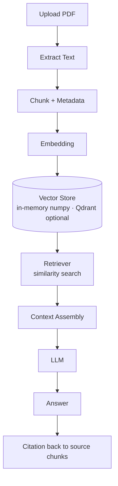

# rag-pipeline

An educational, end-to-end **Retrieval-Augmented Generation (RAG)** pipeline in Python.
It walks a document from **PDF upload → grounded answer with citations**, making every
RAG stage explicit and easy to understand.

The goal is learning: chunking, metadata, embeddings, vector search, similarity, and the
context window are each isolated into their own module so the flow of data is obvious.

> **Status:** Working. All eight pipeline stages are implemented and covered by an
> offline pytest suite (11 tests, all passing). The default code path runs with **no
> external services, no network, and no API key** — an in-memory numpy vector store, a
> deterministic local hashing embedder, and a graceful LLM fallback. Anthropic Claude,
> `sentence-transformers`, and Qdrant are optional upgrades. The Docker setup is written
> but was not run in the dev environment (no Docker there).

---

## Architecture Diagram



Stage-to-module mapping:

| Pipeline stage        | Module                       |
| --------------------- | ---------------------------- |
| Extract text (PDF/plain) | `app/ingest/extract.py`   |
| Chunk + metadata      | `app/ingest/chunk.py`        |
| Embedding             | `app/ingest/embed.py`        |
| Vector store          | `app/store/vector_store.py`  |
| Retriever             | `app/retrieve/retriever.py`  |
| LLM call              | `app/generate/llm.py`        |
| Answer assembly       | `app/generate/answer.py`     |
| Citation              | `app/generate/citation.py`   |

---

## Folder Structure

```
rag-pipeline/
├── app/
│   ├── __init__.py
│   ├── main.py              # FastAPI app + CLI demo entrypoint
│   ├── requirements.txt     # intended dependencies (text manifest)
│   ├── Dockerfile
│   ├── ingest/
│   │   ├── __init__.py
│   │   ├── extract.py       # PDF -> raw text
│   │   ├── chunk.py         # text -> chunks (+ metadata)
│   │   └── embed.py         # chunks -> embedding vectors
│   ├── store/
│   │   ├── __init__.py
│   │   └── vector_store.py  # store + query vectors (Qdrant)
│   ├── retrieve/
│   │   ├── __init__.py
│   │   └── retriever.py     # similarity search + context assembly
│   └── generate/
│       ├── __init__.py
│       ├── llm.py           # LLM invocation (Claude + offline fallback)
│       ├── answer.py        # answer assembly from context
│       └── citation.py      # map answer back to source chunks
├── tests/
│   ├── test_pipeline.py     # unit + end-to-end (offline)
│   └── test_api.py          # FastAPI endpoint tests
├── data/                    # local document store (gitkeep)
│   └── .gitkeep
├── docker-compose.yml       # app + optional qdrant vector DB
├── .env.example
├── .gitignore
├── LICENSE
└── README.md
```

---

## Installation Guide

### Run locally (no Docker, no API key) — verified

```bash
# 1. Clone
git clone https://github.com/ranjan-del/rag-pipeline.git
cd rag-pipeline

# 2. Create a virtualenv and install the default (offline) deps
python3 -m venv .venv
source .venv/bin/activate
pip install -r app/requirements.txt

# 3a. Run the end-to-end CLI demo (ingest a sample doc, answer a question)
python -m app.main

# 3b. Or run the test suite
pytest -q

# 3c. Or start the API server
uvicorn app.main:app --reload
# -> http://localhost:8000  (interactive docs at /docs)
```

This is exactly what was used to verify the project. `pytest -q` reports **11
passed**. No API key is required — answers fall back to a deterministic
extractive summary of the retrieved chunks.

### Optional: real Claude answers

Set an Anthropic API key before running and the LLM stage uses Claude
(`claude-sonnet-5`) instead of the fallback:

```bash
export ANTHROPIC_API_KEY=sk-ant-...
pip install anthropic
```

### Optional: Docker (app + Qdrant)

> Not run in the dev environment (no Docker available), but written to be correct.

```bash
cp .env.example .env   # optional — the app runs with no .env
docker compose up
```

The API is then available at `http://localhost:8000` and Qdrant at
`http://localhost:6333`. Qdrant is optional — the default code path uses the
in-memory store and does not connect to it.

---

## Features

- **PDF upload + text extraction** — turn source documents into raw text.
- **Configurable chunking with metadata** — chunk strategy is explicit and visible.
- **Embeddings** — encode chunks into vectors for semantic search.
- **Vector database (Qdrant)** — store and query embeddings.
- **Retriever** — similarity search with context assembly that respects the context window.
- **Grounded answers with citations** — every answer references its source chunks.
- **Runs with `docker compose up`** — app plus vector DB in one command.

---

## Screenshots

_Not captured yet._ FastAPI serves interactive API docs at `/docs` once the
server is running (`uvicorn app.main:app`).

---

## Demo GIF

_Not captured yet._ Run `python -m app.main` for a text demo of the full flow.

---

## API Documentation

Base URL: `http://localhost:8000`

| Method | Endpoint        | Description                                         |
| ------ | --------------- | --------------------------------------------------- |
| GET    | `/health`       | Liveness + number of chunks currently indexed       |
| POST   | `/ingest`       | Ingest raw text (extract → chunk → embed → store)   |
| POST   | `/ingest/file`  | Ingest an uploaded file (PDF via pypdf, else text)  |
| POST   | `/query`        | Ask a question; returns an answer + citations       |

### `POST /ingest`

```json
// request
{ "text": "Photosynthesis converts sunlight into energy...", "source": "notes.txt" }
// response
{ "ingested_chunks": 3, "total_chunks": 3 }
```

### `POST /ingest/file`

Multipart form upload with a `file` field. `.pdf` files are parsed with pypdf;
any other file is decoded as UTF-8 text.

```bash
curl -F "file=@paper.pdf" http://localhost:8000/ingest/file
```

### `POST /query`

```json
// request
{ "question": "What is photosynthesis?", "top_k": 3 }
// response
{
  "question": "What is photosynthesis?",
  "answer": "... [1] ...",
  "citations": [
    { "marker": "[1]", "chunk_id": "notes.txt-p1-c0", "source": "notes.txt",
      "page": 1, "score": 0.41, "snippet": "Photosynthesis converts..." }
  ]
}
```

Each citation's `marker` matches the `[n]` reference in the answer text and maps
back to the source chunk's metadata (source, page, chunk id).

---

## Future Improvements

- Multiple chunking strategies (fixed, semantic, recursive) selectable at ingest time.
- Support for additional document types (DOCX, HTML, plain text).
- Re-ranking of retrieved chunks before context assembly.
- Pluggable embedding models and LLM providers.
- A lightweight web UI for uploading documents and inspecting each pipeline stage.
- Evaluation harness for retrieval quality and answer faithfulness.

---

## License

Released under the [MIT License](./LICENSE).
